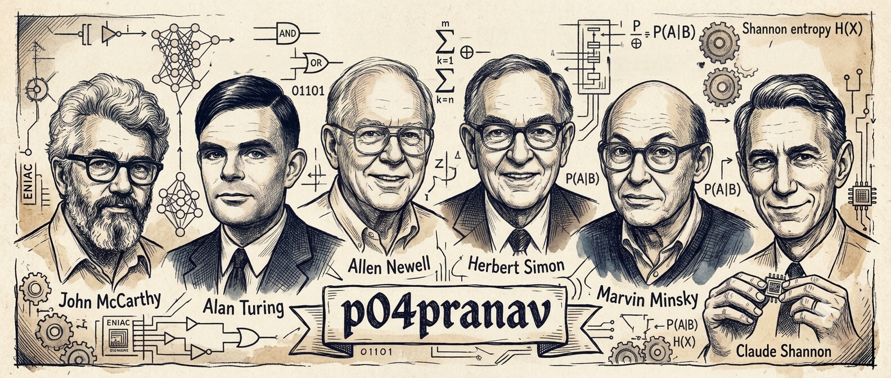

<h3 align="center">Agentic Engineer · Backend & LLM Pipelines · Making Crazy Ideas True...</h3>

---

# 💫 About Me:

🔭 **I'm currently working on** → agentic AI systems and multi-agent orchestration pipelines — building LLM-driven backends end to end, from architecture through deployment 
👯 **I'm looking to collaborate on** → agentic system design, LLM training pipelines (LoRA/SFT), and backend infra (FastAPI, WebSockets, MCP) 
🤝 **I'm looking for help with** → scaling multi-agent architectures cleanly and pushing cost-aware inference further at production scale 
🌱 **I'm currently learning** → efficient model architectures, MCP-based agent orchestration, and advanced RAG + model evaluation 
💬 **Ask me about** → agentic AI, system design, LLM fine-tuning (LoRA/SFT), core Python, or how to make an AI system dramatically cheaper without gutting it 
⚡ **Fun fact** → I research every implementation path before writing a line of code, then pick the cheapest one that still holds up under load. Good design is what keeps systems cheap to run *and* cheap to extend.

> 🎓 Student. I build **backend services**, **agentic AI systems**, and **LLM training pipelines** end to end.
> Strong in **core Python**, working experience in **TypeScript / JavaScript**, with a background in **AR.js / A-Frame web AR**.
> Cost-conscious by default — my projects run on **$0** of API spend by architecture, not by accident.

---

## 🌐 Socials:

---

# 💻 Tech Stack:

**Languages**

 

**AI / ML**

 

**Backend & Data**

 

 

**DevOps & Cloud**

 

**Web & AR**

 

 

---

---

# 🚀 What I've Built:

 

<b>🧠 Agent-NEE FinAI</b> — multi-agent local LLM framework with a self-improvement loop

 

Three specialist agents analyze independently; a Synthesizer merges them into one structured prediction. **All inference runs offline** — no data leaves the machine, no API bill.

| System design decision | Why it matters |
|---|---|
| **Two-phase Parquet ledger** | Phase 1 writes 26 cols + UUID at prediction time; Phase 2 resolves at T+5min. UUID matching instead of timestamp joins → **zero temporal leakage** in training data. |
| **LoRA SFT self-improvement** | Trains on correct predictions only, with class balancing, OOM auto-recovery, and validation rollback so the model can't degrade itself. |
| **Subprocess training isolation** | Heavy training deps never get imported into the main event loop. |
| **Hardware auto-detection** | Probes CUDA / VRAM / CPU at boot and scales workload accordingly. Zero config. |
| **Realtime dashboard** | FastAPI + WebSocket, 1 FPS push, origin validation, CSP headers, XSS escaping. |

**Measured:** multi-agent ensemble `+3.5%` over single agent · LoRA SFT `+2.9%` over base model. Full research paper + technical SPEC included.

`Python` `Ollama` `PEFT/LoRA` `PyArrow` `FastAPI` `PyTorch` `WebSockets`

<b>📊 BIFAS</b> — Sprint Architecture for parallel agent execution at $0 API cost

 

An orchestrator decomposes a query into independent micro-tasks, fans them out **concurrently**, then synthesizes and audits the result.

| System design decision | Why it matters |
|---|---|
| **Sprint Architecture** | Task decomposition → `ThreadPoolExecutor` fan-out → synthesis → audit. 5-min hard timeout with graceful partial results. |
| **7 keyless data sources** | Zero paid API keys anywhere in the pipeline. |
| **Per-task context injection** | Each agent receives only the data it needs — tighter context, fewer tokens, less drift. |
| **Resilience layer** | Backoff on transient 5xx across all 4 phases, retry loops, JSON-truncation fixes, CoT thought-part extraction. |

**Tested:** 9/9 configurations passed across 3 domains × 3 depths — all audit-approved.

`Python` `Streamlit` `ThreadPoolExecutor` `Gemma` `pandas-ta`

<b>🔬 CARS-R v0.1.0</b> — research language model · learned byte-patch routing + CPLA latent attention <code>2026</code>

 

Co-developed with [Bharath](https://github.com/Bharath122babu). A **tokenizer-free byte language model** that allocates computation along two independent axes: *how many bytes compress into one patch*, and *how many recurrent updates a shared patch block runs*. Adaptive sequence compression and selective computation, from first principles.

| Architecture decision | What it does |
|---|---|
| **Learned byte-patch routing** | An information-mass router closes a patch when accumulated signal crosses threshold, under hard min/max bounds — segmentation is learned inside the model, not fixed outside it by a tokenizer. |
| **CPLA — Patch Latent Attention** | Stores one shared content latent + one span-position key per patch instead of full K/V. Compresses the *feature* dimension while patching compresses the *sequence* dimension. |
| **Dual span-position encoding** | Patch order and original byte-centre geometry encoded separately, so a 2-byte and an 8-byte patch aren't treated as equally spaced units. |
| **Recurrence-independent memory** | Recurrent patch updates query one fixed historical memory — cache doesn't multiply with recurrence depth. |
| **Straight-through routing** | Hard patches in the forward pass, soft assignment for gradients — no tensor leaves the device to define segmentation. |

**Evaluation discipline:** matched GQA/MLA controls at equal parameters and data, paired bootstrap CIs, sealed confirmation set, 27-test correctness suite covering full-forward vs. cached-decode equivalence. Withdrawn conclusions and negative results stay in the audit trail rather than being quietly dropped.

**Results:** 40/48 seed-domain wins on an untouched confirmation set · **1.22×** cached-generation throughput over a matched dense baseline.

`PyTorch` `Byte-level LM` `Latent Attention` `Adaptive Computation` `Thompson Sampling`

<b>⚡ CRISPE-AI</b> — prompt engineering tooling, fully client-side

 

Turns raw ideas into structured CRISPE-framework prompts. Live typewriter output, no backend to pay for.

`React` `TypeScript` `Tailwind CSS` `Vite`

🔗 [kushal98457-ctrl/CRISPE-AI](https://github.com/kushal98457-ctrl/CRISPE-AI)

---

# 📊 GitHub Stats:

<table align="center">
<tr>
<td width="50%" align="center">

</td>
<td width="50%" align="center">

</td>
</tr>
</table>

### 👾 Contribution Invaders

<picture>
  <source media="(prefers-color-scheme: dark)" srcset="https://raw.githubusercontent.com/p04pranav/p04pranav/output/invaders-dark.svg" />
  <source media="(prefers-color-scheme: light)" srcset="https://raw.githubusercontent.com/p04pranav/p04pranav/output/invaders.svg" />
  
</picture>

---

### 💭 My Belief

<h2 align="center"><i>"Bad Code is the Most Expensive Code!"</i></h2>

---

<i>Knowledge for precision. Agents for velocity.</i> 
Open to: agentic AI · LLM infra · backend engineering · research collabs

